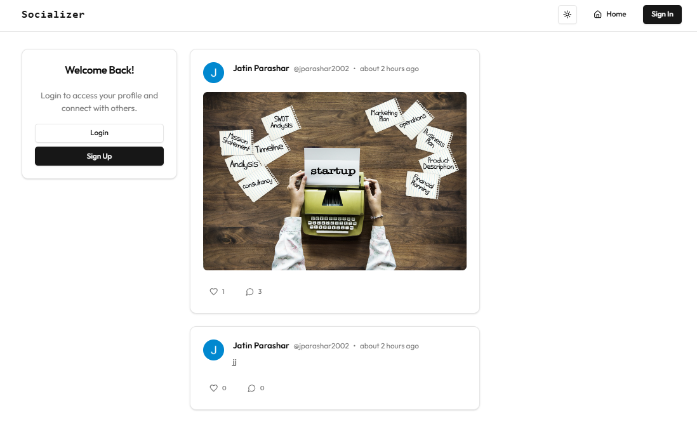

# Socializer

Socializer is a modern social networking platform built with Next.js, Postgres, Prisma, Clerk, and TypeScript. It enables users to connect, share moments, and engage with content seamlessly.

## Deployed Website Link :

https://socializer-beige.vercel.app

## Features

### Authentication
- Secure user authentication using Clerk.

### UI & UX
- Dark/Light mode support.
- Styled with Tailwind CSS and Shadcn.
- Responsive and accessible design.

### Core Functionality
- User profiles with editable details.
- Post creation, editing, and deletion.
- Like, comment, and delete posts.
- Follow/unfollow users.
- Notifications for user interactions.
- Optimistic UI updates for a smooth experience.

### API & Data Management
- Server Components and Client Components integration.
- Server Actions for seamless form handling.
- API routes with Route Handlers.
- Efficient data fetching, caching, and revalidation.
- Dynamic and static routing.

### File Uploads & Media Handling
- Image uploads using UploadThing.
- Profile picture and post image support.

### Database & Backend
- PostgreSQL database powered by Prisma ORM.
- Secure and efficient data storage.

### Error Handling & UX Enhancements
- Custom error pages (`not-found.tsx`).
- Graceful handling of API failures.

## Technologies Used

### Frontend
- Next.js (App Router)
- TypeScript
- Tailwind CSS & Shadcn

### Backend
- Next.js Route Handlers
- Prisma ORM
- PostgreSQL
- Clerk for authentication
- Server Actions for form handling

### Deployment
- Optimized for production deployment.

## Screenshots

### HomePage (For LoggedOut Users)

    

### Authentication Page

    

### HomePage (For LoggedIn Users)

    

### DarkMode

    

### Profile Page

    

### Edit Profile Popup

    

### Profile Posts 

Here users can see posts made by them and the posts they liked.

    

### Notifications Section

    

## Future Improvements
- Real-time messaging system.
- Advanced search and filtering.
- AI-powered content recommendations.
- Group and community features.
- Stories and short video support.

Socializer is designed to provide a seamless and engaging social media experience. With modern technologies and best practices, it ensures a scalable and performant platform for users to connect and share content.
